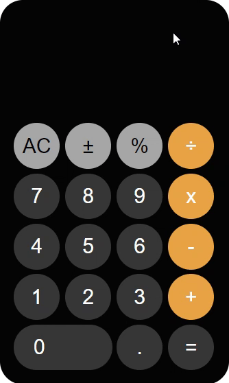

# Project-04 : Ios Calculator (HC-04)

## Description
- Create an IOS calculator with the CSS-GRID structure shown in the image.

## Expected Outcome

## Objective

Design a IOS CALCULATOR that is functionally similar to one shown in expected outcome.

### At the end of the project, following topics are to be covered;

- HTML 

- CSS

## Steps to Solution
  
- Step 1: Download or clone project repo on Github 

- Step 2: Create project folder for local public repo on your pc

<strong> ⌛ Happy Coding  ✍</strong> 
